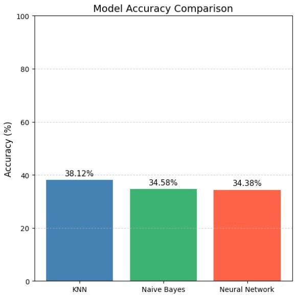

# Software Quality Classification using Machine Learning: A Comparative Evaluation
A machine learning project for predicting software quality using static code metrics and multiclass classification algorithms.

## Project Highlights

- **Dataset:** 1,600 software components
- **Task:** Multiclass software quality classification
- **Models:** KNN, Naive Bayes, and MLP
- **Best Model:** KNN (38.12% Accuracy)

## Overview

Software quality prediction is an important task in software engineering that helps identify components requiring additional testing and maintenance. By analyzing static code metrics, machine learning models can assist in early quality assessment, reducing manual effort and supporting more informed software engineering decisions.

This project investigates the use of machine learning algorithms to classify software quality into three categories—**Low**, **Medium**, and **High**. The complete workflow includes exploratory data analysis, data preprocessing, model development, and comparative performance evaluation to analyze the effectiveness of different classification techniques.

## Project Objectives

The primary objectives of this project are to:

- Develop machine learning models to predict software quality using static code metrics.
- Analyze the dataset through exploratory data analysis (EDA) to understand feature distributions and relationships.
- Apply appropriate preprocessing techniques to prepare the dataset for model training.
- Compare the performance of multiple classification algorithms using standard evaluation metrics.
- Identify the most effective model for software quality classification on the given dataset.

## Dataset

The project uses a software quality dataset consisting of static software metrics collected from software components. The objective is to classify each component into one of three software quality categories based on these metrics.

| Attribute | Description |
|-----------|-------------|
| **Total Samples** | 1,600 |
| **Input Features** | 8 |
| **Target Variable** | `Quality_Label` |
| **Problem Type** | Multiclass Classification |
| **Classes** | Low, Medium, High |

### Features

- Lines of Code
- Cyclomatic Complexity
- Number of Functions
- Code Churn
- Comment Density
- Number of Bugs
- Code Owner Experience
- Has Unit Tests

## Methodology

The project follows a structured machine learning workflow, beginning with data exploration and ending with comparative model evaluation.

### Exploratory Data Analysis (EDA)

The dataset was explored using descriptive statistics and visualization techniques to understand feature distributions, identify potential outliers, examine class balance, and analyze relationships between variables.

### Data Preprocessing

The preprocessing pipeline included:

- Missing value imputation
- Categorical feature encoding
- Label encoding
- Feature normalization

### Dataset Splitting

The processed dataset was divided into:

- **Training Set:** 70%
- **Testing Set:** 30%

### Model Development
The following classification models were implemented and evaluated:

- K-Nearest Neighbors (KNN)
- Naive Bayes
- Multi-Layer Perceptron (MLP)

### Performance Evaluation

Model performance was assessed using:

- Accuracy
- Precision
- Recall
- F1-score
- Confusion Matrix
- ROC Curve

## Experimental Results

Three classification algorithms were trained and evaluated to assess their effectiveness in predicting software quality. Performance was measured using standard classification metrics and comparative analysis.

| Model | Accuracy |
|:------|---------:|
| K-Nearest Neighbors (KNN) | 38.12% |
| Naive Bayes | 34.58% |
| Multi-Layer Perceptron (MLP) | 34.38% |

KNN achieved the highest overall accuracy among the evaluated models, although the performance differences were relatively small.
<p align="center">
  
</p>

<p align="center"><em>Figure 1. Accuracy comparison of the evaluated classification models.</em></p>

### Performance Analysis

The experimental results indicate that the K-Nearest Neighbors classifier achieved the highest overall performance on this dataset. However, the relatively low accuracies across all three models suggest that the available software metrics provide limited predictive power for distinguishing software quality classes. This highlights the need for richer feature representations and additional model optimization.

## Key Findings

- Among the evaluated models, **K-Nearest Neighbors (KNN)** achieved the highest classification accuracy of **38.12%**.
- The software metrics exhibited generally weak linear correlations with the target variable, limiting the predictive performance of all three models.
- The **Medium** quality class was the most challenging to classify, as observed from the confusion matrices.
- The results demonstrate that software quality prediction is feasible using machine learning, while highlighting the importance of improved feature representation and model optimization.

## Future Work

Several improvements can be explored to further enhance the performance and applicability of this project:

- Perform hyperparameter optimization to improve the predictive performance of the classification models.
- Apply feature selection and feature engineering techniques to extract more informative software metrics.
- Evaluate additional machine learning algorithms, including ensemble methods such as Random Forest and XGBoost.
- Incorporate cross-validation to obtain a more robust assessment of model performance.
- Expand the study using larger and more diverse software quality datasets to improve model generalization.

## Tech Stack

**Programming Language**
- Python

**Development Environment**
- Jupyter Notebook

**Libraries**
- Pandas
- NumPy
- Matplotlib
- Seaborn
- Scikit-learn

## Repository Structure

```
software-quality-classification/
│
├── data/
│   ├── raw/
│   └── processed/
│
├── notebooks/
│   └── software_quality_classification.ipynb
│
├── report/
│   └── software_quality_classification_report.pdf
│
├── images/
│   ├── eda/
│   │   └── correlation_heatmap.png
│   └── results/
│       ├── model_accuracy_comparison.png
│       ├── confusion_matrix_knn.png
│       ├── confusion_matrix_nb.png
│       ├── confusion_matrix_mlp.png
│       ├── roc_curve.png
│       └── mlp_loss_curve.png
│
├── README.md
├── requirements.txt
├── LICENSE
└── .gitignore
```

## Project Resources

- 📓 **Jupyter Notebook:** `notebooks/software_quality_classification.ipynb`
- 📄 **Project Report:** `report/software_quality_classification_report.pdf`
- 📁 **Dataset:** `data/raw/software_quality_dataset.csv`


## Acknowledgements

This project was developed as part of the **CSE422 – Artificial Intelligence** course at **BRAC University**.

## Author

**Alena Halder Tamo**

B.Sc. in Computer Science and Engineering  
BRAC University

- GitHub: https://github.com/alena-tomo